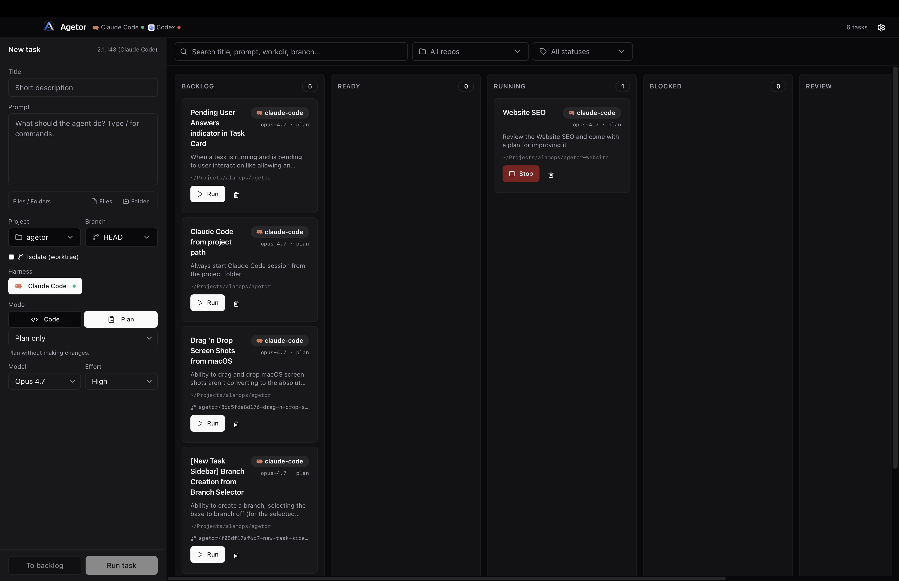

# Agetor

**Sitio web:** [agetor.dev](https://agetor.dev)

> Un tablero kanban centrado en lo local para orquestar agentes de código CLI — Claude Code, OpenAI Codex y otros — a través de múltiples tareas y repositorios simultáneamente.

Agetor transforma un tablero kanban en un plano de control para agentes de IA. Cada tarjeta es un prompt más un directorio de trabajo más una elección de agente; al iniciarla, se ejecuta el agente como un proceso hijo dentro de un worktree (árbol de trabajo) git aislado, transmite su salida de vuelta a la interfaz y mueve la tarjeta a través de las columnas a medida que avanza la ejecución. Las aprobaciones, preguntas de aclaración y mensajes de seguimiento fluyen a través de tarjetas estructuradas en el panel de ejecución en lugar de perderse en una TUI.

Se ejecuta completamente en tu máquina. Sin retransmisión en la nube, sin entorno remoto aislado: los agentes se ejecutan con los privilegios de tu shell en tus repositorios, exactamente como lo harían si los lanzaras manualmente. Agetor solo añade la orquestación, el aislamiento y la interfaz por encima.



---

## Highlights

- **Multi-agente, multi-cuenta.** Soporte integrado para `claude-code` y `codex`. Define *harnesses* (configuraciones de agente) adicionales para ejecutar una segunda cuenta de Claude o Codex en paralelo; cada una obtiene un `$HOME` dedicado para que los inicios de sesión, el historial y la configuración nunca choquen entre sí.
- **Worktrees git por tarea.** Cada tarea se ejecuta en su propia rama (`agetor/<short-id>-<slug>`) dentro de un worktree dedicado bajo `~/.agetor/worktrees/`. Dos agentes pueden trabajar en el mismo repositorio simultáneamente sin interferir. La referencia base se fija al momento de crearla, por lo que las reejecuciones siempre inician desde el mismo commit.
- **Sesiones interactivas con Claude.** Claude Code se ejecuta en una sesión `tmux` por tarea que permanece activa a través de múltiples turnos. Da seguimiento a una tarea sin perder la conversación. La salida se transmite haciendo `tail` al transcript JSONL propio de Claude, por lo que el texto del asistente, bloques de razonamiento, llamadas a herramientas y resultados de herramientas se renderizan con sus propios componentes de UI.
- **Aprobaciones y preguntas, extraídas de la TUI.** Agetor observa el panel de tmux de Claude y el transcript JSONL para detectar modales `AskUserQuestion` / `ExitPlanMode` y prompts de permisos de herramientas, y los muestra en el panel de ejecución como tarjetas estructuradas — radios, casillas de verificación, texto libre. Es completamente no invasivo: no registra un servidor MCP ni instala ningún hook (solo elimina entradas obsoletas dejadas por compilaciones anteriores). Los prompts de Codex se detectan heurísticamente desde stdout y se muestran de la misma manera.
- **Flujo de eventos en vivo.** SSE por tarea y un canal global de eventos. Toasts de estado y notificaciones nativas se disparan cuando una ejecución termina, tiene éxito, falla o se bloquea esperando entrada.
- **Reejecuciones reproducibles.** El historial de ejecución persiste por tarea. Cancelar una ejecución mantiene la sesión de tmux viva para que puedas iterar; eliminar una tarea desmonta su worktree, rama y sesión.
- **SQLite local.** Todo el estado — tareas, ejecuciones, eventos, proyectos, harnesses, preferencias, reglas de aprobación — vive en `~/.agetor/agetor.sqlite` con un ejecutor de migraciones versionado. Nada sale de tu máquina.

---

## How it works

Agetor es una aplicación [Electrobun](https://github.com/blackboardsh/electrobun) — un proceso principal de Bun que posee la ventana y un WebView nativo que renderiza la UI.

```
┌─────────────────────────┐       HTTP + SSE        ┌─────────────────────────┐
│  React webview          │ ◀──────────────────────▶│  Bun main process        │
│  (kanban, run panel)    │   127.0.0.1 + token     │  (SQLite, orchestrator) │
└─────────────────────────┘                         └─────────────┬───────────┘
                                                                  │ spawn
                                                  ┌───────────────┴───────────────┐
                                                  ▼                               ▼
                                       ┌──────────────────┐            ┌──────────────────┐
                                       │  tmux: claude    │            │  codex exec      │
                                       │  (per task)      │            │  (one-shot)      │
                                       └──────────────────┘            └──────────────────┘
                                                  │                               │
                                                  ▼                               ▼
                                       ┌──────────────────┐            ┌──────────────────┐
                                       │ git worktree per │            │ git worktree per │
                                       │ task             │            │ task             │
                                       └──────────────────┘            └──────────────────┘
```

Algunas decisiones de diseño clave:

- **API en localhost, no RPC de Electrobun.** El webview se comunica con el proceso principal a través de una API HTTP simple enlazada a `127.0.0.1` en un puerto configurable. Cada ruta (excepto `/health`) requiere un token bearer aleatorio por lanzamiento, pasado al webview a través de un preload `WKUserScript`. Un sitio que visites por casualidad no puede impulsar una ejecución de agente incluso si adivina el puerto.
- **Una sesión tmux por tarea de Claude.** `claude` se ejecuta en modo interactivo (para que consumas tu cuota de suscripción normal, no el crédito del SDK de Agentes). Los prompts se entregan como pulsaciones de teclas vía `tmux load-buffer + paste-buffer + send-keys`. La salida se lee del JSONL que Claude escribe en `~/.claude/projects/<encoded-cwd>/<sessionId>.jsonl`.
- **Codex sigue siendo one-shot.** Cada ejecución de Codex es una invocación fresca de `codex exec`; los seguimientos crean un nuevo registro de ejecución en la misma tarea.
- **Reconciliación al inicio.** Al arrancar, cualquier sesión de tmux leftover de un proceso anterior de Agetor se elimina, y cualquier fila marcada aún como `running` se cambia a `orphaned`. El kanban nunca muestra tarjetas atascadas.

La arquitectura completa, el esquema y el ciclo de vida están documentados en [`CLAUDE.md`](./CLAUDE.md).

---

## Requirements

- **Bun** ≥ 1.1 ([instalar](https://bun.sh))
- **tmux** — requisito estricto para el controlador de Claude Code
  - macOS: `brew install tmux`
  - Debian/Ubuntu: `apt install tmux`
- **Al menos un CLI de agente en `PATH`:**
  - `claude-code`: `npm i -g @anthropic-ai/claude-code`
  - `codex`: `npm i -g @openai/codex`
- **Git** — requerido para el aislamiento de worktrees
- **Plataformas:** macOS (principal). Las compilaciones para Linux y Windows están configuradas en `electrobun.config.ts` pero no se prueban actualmente.

Los agentes se inician con tus privilegios completos de shell en el directorio que indique la tarea. No hay sandbox.

---

## Getting started

```bash
# Clonar e instalar
git clone https://github.com/alamops/agetor.git
cd agetor
bun install

# Compilar el paquete del webview una vez (requerido para `bun run dev`)
bun run build

# Ejecutarlo
bun run dev
```

Para iterar en la UI, ejecuta Vite y Electrobun juntos:

```bash
bun run dev:hmr
```

Esto inicia Vite en el puerto `5173` para recarga en caliente y Electrobun en modo dev en paralelo. Los cambios en el proceso principal (cualquier cosa bajo `src/bun/`) *no* se recargan en caliente; reinicia `bun run dev:hmr` después de editarlos.

### Primera tarea

1. Haz clic en **New task** en el riel izquierdo.
2. Elige un workdir (cualquier carpeta local; si es un repositorio git, obtendrás aislamiento de worktree automáticamente).
3. Elige un agente y un modelo, y escribe tu prompt.
4. Pulsa **Run task** para iniciarla inmediatamente, o **To backlog** para ponerla en cola.

Arrastra tarjetas entre columnas para sobrescribir el flujo manualmente. Abre una tarjeta para ver el flujo de eventos en vivo, enviar mensajes de seguimiento o responder prompts de aprobación.

---

## Command-line interface (`agetor`)

Agetor también se distribuye como un CLI terminal independiente: controla el mismo tablero desde tu shell, con o sin la aplicación de escritorio abierta.

### Install

```bash
curl -fsSL https://github.com/alamops/agetor/releases/latest/download/install.sh | sh
```

El instalador es solo para arm64-macOS (coincidiendo con la app), verifica una suma de comprobación SHA-256 y coloca un único binario `agetor` en `/usr/local/bin` (con fallback a `~/.local/bin`). Para compilarlo desde el código fuente en su lugar:

```bash
bun run build:cli          # → artifacts/agetor-arm64 (+ .sha256, install.sh)
# …o ejecutar directamente desde el código fuente, sin compilación:
bun src/cli/index.ts --help
```

### How it connects

El CLI es un cliente ligero sobre la misma API en localhost que usa el webview. Descubre el núcleo en ejecución a través de un archivo de credenciales `0600` (`~/.agetor/agetor-core.json`, escrito al lanzamiento con el puerto y token por lanzamiento). Si la app de escritorio está abierta, el CLI se comunica con ella; si no, **inicia automáticamente un daemon en segundo plano sin cabeza** que comparte el mismo estado `~/.agetor`, por lo que una tarea que agregues desde el CLI aparecerá en la app y viceversa. Cuando luego abras la app, el daemon cede el puerto a esta.

Respeta las mismas variables `AGETOR_DATA_DIR` / `AGETOR_API_PORT` que la app, por lo que, por ejemplo, `AGETOR_DATA_DIR=~/.agetor-dev agetor ls` apunta al árbol de desarrollo.

### Commands

```bash
agetor                       # panel de control en pantalla completa en vivo (tablero + detalle en streaming + compose/respuesta en línea)

# create · inspect
agetor add                   # crear una tarea (asistente guiado, o --title/--prompt[/--start])
agetor ls [filters]          # listar tareas (--column/--agent/--type/--repo/--search/--archived/--all)
agetor ps                    # listar solo tareas en ejecución / bloqueadas
agetor show <id>             # detalles, ejecuciones, interacciones pendientes

# run · converse
agetor start <id>            # ejecutar una tarea aún no iniciada
agetor send <id> <msg…>      # enviar mensaje a una tarea (--ref <path> para adjuntar archivo/imagen; reanuda una finalizada)
agetor commit <id>           # pedir al agente que haga commit de todos los cambios y haga push de la rama
agetor answer <id>           # responder a una tarea que necesita entrada (selector interactivo)
agetor commands <id>         # listar los comandos slash del agente + extensiones (autocompletado del compositor)
agetor logs <id>             # transmitir la conversación en vivo de una tarea (--no-follow snapshot · --notify al cambiar de estado · --rebuild desde JSONL)
agetor cancel <id>           # detener la ejecución activa
agetor attach <id>           # conectar tu terminal a la sesión tmux en vivo (claude-code)
agetor shell <id>            # abrir un shell en el worktree de la tarea (--print para la ruta)

# manage
agetor edit <id> [flags]     # cambiar título/prompt/agente/workdir/modelo/modo/esfuerzo/tipo/columna
agetor move <id> <column>    # mover entre columnas (marcar como hecho = move <id> done)
agetor archive <id>          # archivar una tarea hecha · unarchive <id> para restaurar
agetor diff <id>             # mostrar el diff git de la tarea
agetor rm <id> --yes         # eliminar una tarea (worktree + rama)

# setup
agetor projects <sub>        # list | add <path> | rm <path> | branches <path>
agetor harness <sub>         # list | add | edit | enable | disable | rm | shell  (alias / cuentas; shell = iniciar sesión)
agetor daemon status|start|stop
agetor info                  # versión del núcleo conectado
agetor config [k] [v]        # ver / establecer preferencias del núcleo (defaultHarness, último modelo/modo/esfuerzo)
```

**Teclas del dashboard:** `↑/↓` (o `j/k`) seleccionar · `s` ejecutar · `x` detener · `m` mensaje · `c` commit & push · `g` responder · `q` salir. Los mensajes y respuestas ocurren en línea; los toasts de estado de ejecución parpadean en éxito / fallo / necesita-tu-acción.

Cada comando acepta `--json` para scripting, `--data-dir <dir>` / `--port <n>` para apuntar a un núcleo específico, y `--no-daemon` para fallar en lugar de iniciar uno automáticamente. Los prefijos de ID cortos (los 8 caracteres mostrados en `agetor ls`) funcionan donde se espera un `<id>`. El `.dmg`/`.app` de escritorio no cambia: el CLI es una superficie adicional, no un reemplazo.

---

## Configuration

Todo el estado persistente vive en `~/.agetor/` (sobrescribir con `AGETOR_DATA_DIR`):

```
~/.agetor/
├── agetor.sqlite               # tareas, ejecuciones, eventos, proyectos, harnesses, preferencias
├── agetor-core.json            # archivo de credenciales 0600: puerto + token del núcleo en ejecución (auth CLI)
├── daemon.log                  # log del daemon CLI sin cabeza (cuando la app no está corriendo)
├── worktrees/<task-id>/        # worktrees git por tarea
└── harnesses/<id>/             # HOME por harness opcional (multi-cuenta)
```

### Environment variables

| Variable | Propósito | Default |
| --- | --- | --- |
| `AGETOR_DATA_DIR` | Dónde viven la base de datos SQLite, los worktrees y los scripts bin. | `~/.agetor` |
| `AGETOR_API_PORT` | Puerto en localhost donde se enlaza el proceso principal. | `4317` |
| `AGETOR_CLAUDE_BIN` | Sobrescribir la ruta del binario `claude`. | `claude` en `PATH` |
| `AGETOR_CLAUDE_ARGS` | Args adicionales añadidos a cada lanzamiento de Claude. | *(ninguno)* |
| `AGETOR_CODEX_BIN` | Sobrescribir la ruta del binario `codex`. | `codex` en `PATH` |
| `AGETOR_CODEX_ARGS` | Args adicionales añadidos a cada lanzamiento de Codex. | *(ninguno)* |
| `AGETOR_TMUX_BIN` | Sobrescribir la ruta del binario `tmux`. | `tmux` en `PATH` |
| `AGETOR_CLAUDE_DRIVER` | Establecer en `fake` para omitir tmux + el CLI real (solo pruebas). | sin definir |
| `AGETOR_DAEMON_IDLE_MS` | Daemon CLI: apagado por inactividad después de este tiempo sin ejecución ni cliente conectado. `0` desactiva. | `300000` (5 min) |

Las sobrescrituras `bin`, `home` y `env` por harness se configuran a través del diálogo de Configuración y se almacenan en SQLite; tienen precedencia sobre las variables de entorno correspondientes.

---

## Concepts

### Tasks, columns, and runs

Una **tarea** es un prompt + workdir + agente. Vive en una de seis columnas:

| Columna | Significado |
| --- | --- |
| Backlog | En cola, no iniciada. |
| Ready | Creada vía "Run task" pero esperando verificación previa. |
| Running | El agente está produciendo salida activamente. |
| Blocked | El agente está esperando una aprobación, pregunta o revisión de plan. |
| Review | La última ejecución salió con `0`. El diff es tuyo para inspeccionar. |
| Done | Has decidido que estás satisfecho. |

Una **ejecución** es una invocación única del agente en una tarea. Las tareas acumulan historial de ejecuciones; el panel de ejecución puede reproducir los eventos de cualquier ejecución pasada.

### Harnesses

Un **harness** es una configuración de agente con nombre. Los dos integrados (`claude-code`, `codex`) envuelven cada CLI directamente. Los harnesses definidos por el usuario son *aliases* que envuelven el mismo tipo subyacente con variables de entorno extra, un binario alternativo o, lo más útil, una sobrescritura de `$HOME` por cuenta. Ese último ajuste te permite ejecutar una segunda cuenta de Claude o Codex en paralelo sin que sus inicios de sesión se sobrescriban mutuamente.

Añade un harness desde **Settings → Harnesses**. Las plantillas precargan patrones comunes.

### Modes, models, and effort

Cada tarea elige:

- un **modo** — cuántos permisos tiene el agente (`auto`, `ask`, `acceptEdits`, `plan`, `bypass` — expuesto por agente),
- un **modelo** — Opus / Sonnet / Haiku para Claude, GPT-5 / GPT-5 Codex para Codex,
- un nivel de **esfuerzo** — profundidad de razonamiento, donde el modelo lo soporte.

El selector filtra combinaciones incompatibles (por ejemplo, el esfuerzo se oculta en Haiku 4.5 porque la API de Anthropic no lo acepta allí).

### Worktree isolation

Cuando `isolation: "worktree"` (el predeterminado), iniciar una tarea en un repositorio git:

1. Resuelve la referencia base a un sha (fijado en la fila — las reejecuciones reproducen).
2. Crea `~/.agetor/worktrees/<task-id>/` en una rama nueva a partir de ese sha.
3. Inicia el agente con esa ruta como `cwd`.

La limpieza del worktree ocurre automáticamente al eliminar la tarea: `git worktree remove --force` más `git branch -D`, con un fallback de `rm -rf` por si el usuario movió `workdir` de bajo de nuestros pies.

Establece isolation en `"none"` para ejecutar directamente en `workdir` — útil para scripts únicos donde un worktree sería sobrecarga.

### Approvals and clarifying questions

Cuando Claude está a punto de usar una herramienta, el hook `PreToolUse` instalado por Agetor envía el nombre de la herramienta y la entrada a `127.0.0.1:<port>/approvals`. El panel de ejecución renderiza una tarjeta; el usuario hace clic en **Allow**, **Allow always**, o **Deny**. "Allow always" persiste una regla `(task, tool)` en SQLite para que futuros disparos se autoricen sin molestarte.

Cuando Claude quiere hacer una pregunta estructurada, llama a la herramienta `ask_user` en el servidor MCP de Agetor. El webview renderiza radios / casillas / textarea, y la respuesta del servidor MCP desbloquea al agente.

`AskUserQuestion` y `ExitPlanMode` de las herramientas integradas de Claude se interceptan de la misma manera.

---

## HTTP API

El proceso principal expone una pequeña API JSON + SSE en `127.0.0.1:$AGETOR_API_PORT`. Todas las rutas excepto `/health` requieren `Authorization: Bearer $AGETOR_API_TOKEN` (o `?token=...` para `EventSource`).

| Método | Ruta | Propósito |
| --- | --- | --- |
| `GET` | `/health` | Sondeo de disponibilidad. |
| `GET` | `/info` | Versión de app + info de arranque. |
| `GET` | `/defaults` | Directorio home y otros defaults que la UI necesita para expandir `~`. |
| `GET` / `POST` | `/tasks` | Listar o crear tareas. |
| `GET` / `PATCH` / `DELETE` | `/tasks/:id` | Inspeccionar, editar campos autorizados, o eliminar una tarea. |
| `POST` | `/tasks/:id/start` | Iniciar una ejecución para la tarea. |
| `GET` | `/tasks/:id/runs` | Historial de ejecuciones para la tarea (más recientes primero). |
| `GET` | `/tasks/:id/events` | SSE: flujo de eventos unificado a través de todas las ejecuciones para la tarea. |
| `POST` | `/runs/:id/cancel` | Enviar Ctrl-C a la ejecución en progreso; la sesión tmux sobrevive. |
| `POST` | `/runs/:id/input` | Enviar un mensaje de seguimiento del usuario (solo Claude). |
| `GET` | `/runs/:id/events` | SSE: eventos para una única ejecución (reproduce historial, luego transmite en vivo). |
| `GET` / `POST` / `DELETE` | `/harnesses[...]` | Gestionar configuraciones de harness. |
| `GET` | `/agents` | Disponibilidad + sondas de versión por harness. |
| `GET` | `/agent-models` | Modelos descubiertos por sondear cada CLI. |
| `GET` | `/agent-commands` | Comandos slash soportados por el agente activo. |
| `POST` | `/approvals/:id/answer` | Resolver una aprobación de herramienta pendiente. |
| `POST` | `/questions/:id/answer` | Resolver una pregunta `ask_user` pendiente. |
| `POST` | `/ask-questions/:id/answer` | Resolver un `AskUserQuestion` interceptado. |
| `POST` | `/plan-approvals/:id/answer` | Resolver un `ExitPlanMode` interceptado. |
| `GET` | `/tasks/:id/interactions/pending` | Cualquier cosa bloqueando actualmente la tarea. |
| `GET` / `POST` / `DELETE` | `/projects[...]` | Atajos de directorio de trabajo mostrados en el formulario Nueva Tarea. |
| `GET` / `PATCH` | `/preferences[...]` | Preferencias por usuario (clave/valor). |
| `POST` | `/open-path` | Revelar una ruta en Finder / Files. |
| `GET` | `/events` | SSE: flujo global de ciclo de vida (toasts, notificaciones nativas). |

La lista completa de rutas está en [`src/bun/server.ts`](./src/bun/server.ts).

---

## Commands

```bash
bun install                                # install deps
bun run dev                                # Electrobun, loads packaged webview
bun run dev:hmr                            # Vite + Electrobun in parallel (preferred for UI work)
bun run build                              # production bundle (vite build → electrobun build)
bun run build:canary                       # canary channel build
bun run build:stable                       # stable channel build
bun run typecheck                          # tsc --noEmit; must be green
bun test                                   # full test suite (Bun's test runner)
bun test src/bun/orchestrator.test.ts      # single file
bun test -t "createTask"                   # by test name
```

---

## Project layout

```
src/
├── bun/                       # main process: API, orchestration, persistence
│   ├── index.ts               # entrypoint: menus, reconcile orphans, start server, open window
│   ├── server.ts              # Bun.serve routes (HTTP + SSE)
│   ├── orchestrator.ts        # task lifecycle, spawn/cancel/cleanup, event fanout
│   ├── agents.ts              # buildCommand / spawnAgent — single source of truth per agent
│   ├── claude-tmux.ts         # tmux session lifecycle + JSONL tailer
│   ├── agent-status.ts        # availability + version probes per harness
│   ├── agent-discovery.ts     # async model-list discovery
│   ├── worktree.ts            # git worktree create/remove
│   ├── interactions.ts        # approvals + questions registry (in-memory)
│   ├── hook-installer.ts      # writes PreToolUse hook + MCP launcher per task
│   ├── hooks/                 # bundled hook script + system prompt
│   ├── mcp/agetor-mcp.ts      # stdio MCP server exposing `ask_user`
│   ├── commands.ts            # slash-command catalogue per agent
│   ├── db.ts                  # bun:sqlite + bindings
│   ├── migrate.ts             # numbered SQL migration runner
│   └── migrations/            # 001_init.sql … 013_harnesses.sql
├── mainview/                  # React webview (kanban, run panel, settings)
│   ├── App.tsx
│   ├── components/
│   │   ├── kanban/            # board, columns, cards, run panel, pickers
│   │   ├── settings/
│   │   └── ui/                # shadcn-style primitives (hand-rolled)
│   └── lib/api.ts             # typed wrapper around the Bun HTTP API
└── shared/                    # types both processes import (no runtime side effects)
    └── types.ts               # Task, Run, Harness, AGENT_OPTIONS, etc.
```

---

## Security model

- La API se enlaza solo a `127.0.0.1` y está protegida por un token aleatorio por lanzamiento. Incluso si `Access-Control-Allow-Origin` estuviera mal configurado, un origen externo no puede leer el token.
- El token se entrega al webview a través de un preload `WKUserScript` (no una cadena de consulta ni hash, por lo que nunca aparece en la barra de URL ni en logs).
- Los agentes se ejecutan **con tus privilegios completos de shell** en cualquier `workdir` que nombre la tarea. Agetor no los aísla en sandbox. Trátalo como ejecutar el CLI del agente directamente — porque exactamente eso es lo que hace.
- Las reglas de aprobación están acotadas a una sola tarea, nunca globalmente. Cada nueva tarea inicia desde cero.

Si encuentras un problema de seguridad, por favor divúlgalo de forma privada a `alamo@alamoweb.com.br` en lugar de abrir un issue público.

---

## Contributing

Los issues y pull requests son bienvenidos — incluyendo los asistidos por IA y totalmente vibecoded. Si Claude, Codex, Cursor o cualquier otro agente escribió la mayor parte del diff, está bien. Solo manténlo en la misma barra que un PR escrito a mano: tests verdes, tipos limpios y una descripción que haga obvio el *por qué*. (Agetor mismo está construido para hacer este tipo de contribución más fácil — comer de tu propia cocina.)

Algunas convenciones útiles que conocer antes de abrir un PR:

- **`bun run typecheck` debe estar verde.** TypeScript es estricto (`noUncheckedIndexedAccess` está activado).
- **Los tests son obligatorios para cambios de comportamiento.** Los módulos del orquestador y Claude-tmux tienen cobertura particularmente exhaustiva; replica ese estilo. Los tests deben establecer `AGETOR_DATA_DIR` al inicio del archivo (no en `beforeAll`) para evitar la trampa de contaminación de la base de datos de producción documentada en `src/bun/db.ts`.
- **Nunca edites una migración ya aplicada.** Añade un nuevo archivo `.sql` numerado y añádelo a `src/bun/migrations/index.ts`. El ejecutor de migraciones solo rastrea IDs, por lo que ediciones silenciosas divergirán de las bases de datos de usuarios existentes.
- **Los tipos compartidos son libres de runtime.** `src/shared/types.ts` es importado por ambos procesos — sin imports de Node, Bun, React o DOM allí.
- **Las opciones de agente viven en `AGENT_OPTIONS`.** Para añadir un modelo o modo, extiende la lista curada y enseña a `buildCommand` cómo traducirlo. Los IDs desconocidos se pasan verbatim para que los usuarios puedan pegar un lanzamiento reciente antes de que Agetor lo conozca.

Añadiendo un nuevo tipo de agente:

1. Extiende la unión `AgentKind` en `src/shared/types.ts`.
2. Añade una entrada a `AGENT_OPTIONS` con modelos / modos / esfuerzo.
3. Añade una rama en `buildCommand` (`src/bun/agents.ts`) y `spawnAgent`.
4. Muestra indicaciones de disponibilidad en `agent-status.ts`.
5. El orquestador y la UI lo recogen automáticamente.

La arquitectura y los detalles importantes que conocer están documentados en [`CLAUDE.md`](./CLAUDE.md). Leer ese archivo antes de tu primer PR es la acción de mayor impacto que puedes hacer.

---

## Roadmap

Este es un proyecto en etapa temprana. Cosas en la lista a corto plazo:

- Un flujo de desinstalación que elimine las entradas del hook `PreToolUse` y del servidor MCP de `.claude/settings.local.json` en cada repositorio que Agetor tocó.
- Compilaciones de primera clase para Linux y Windows (actualmente configuradas pero sin probar).
- Más tipos de agente: agentes de Cursor, Aider, Gemini CLI.
- Notificaciones push opcionales de Slack / nativas sobre el estado del terminal, no solo toasts.

---

## License

[MIT](./LICENSE) © 2026 Alamo Saravali

---

## Acknowledgements

- [Electrobun](https://github.com/blackboardsh/electrobun) — el runtime de webview nativo sobre Bun sobre el que está construida esta app.
- [Claude Code](https://github.com/anthropics/claude-code) y [OpenAI Codex CLI](https://github.com/openai/codex) — los agentes que Agetor fue construido para orquestar.
- [dnd-kit](https://dndkit.com/), [shadcn/ui](https://ui.shadcn.com/), [Tailwind CSS](https://tailwindcss.com/), [Lucide](https://lucide.dev/), [Sonner](https://sonner.emilkowal.ski/) — el stack de front-end.
