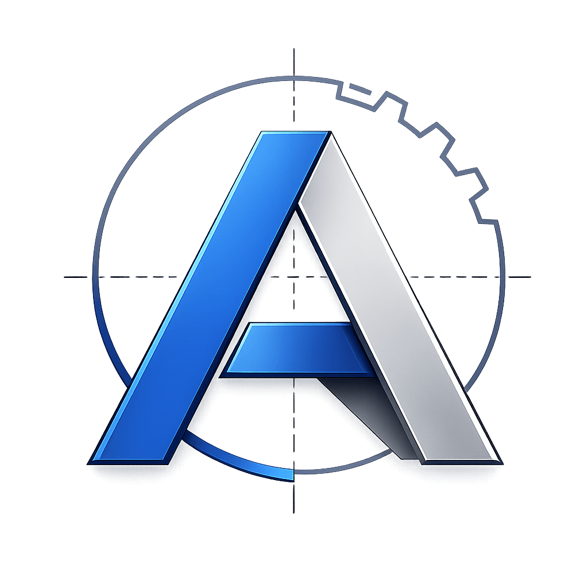
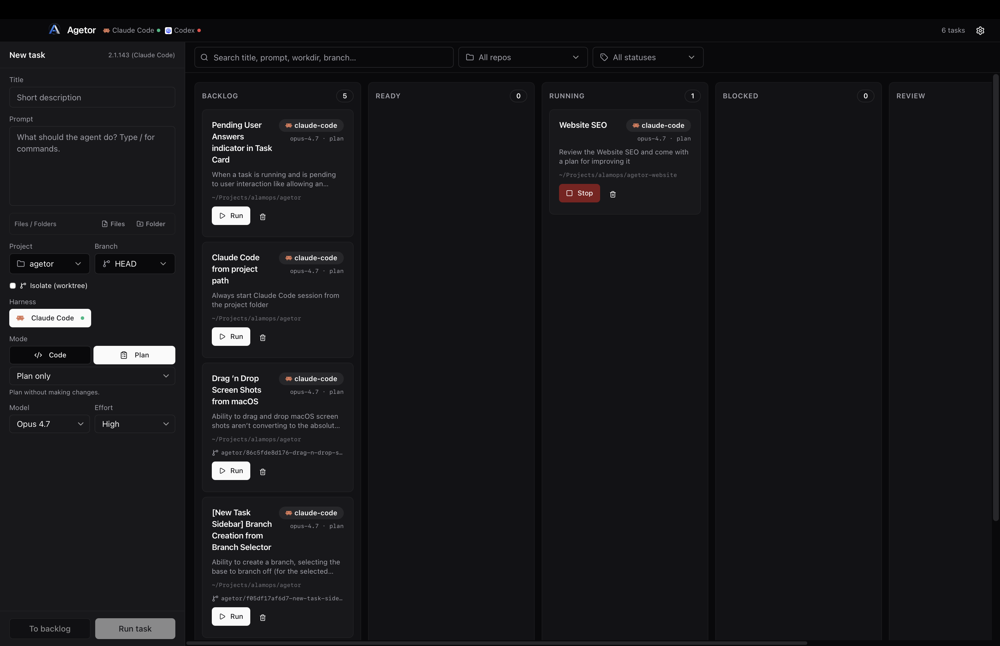
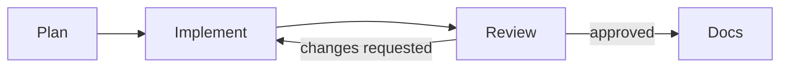
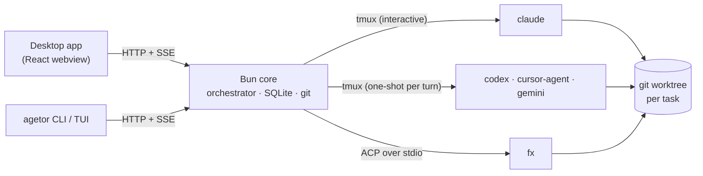

<div align="center">



# Agetor

**The harness orchestrator.**<br />
A local-first kanban for running Claude Code, Codex, Cursor, Gemini CLI and fx in parallel, with each task in its own git worktree.

[](https://github.com/alamops/agetor/releases/latest)
[](#install)
[](./LICENSE)
[](https://bun.sh)
[](https://github.com/sponsors/alamops)

[Website](https://agetor.dev) · [Download](https://github.com/alamops/agetor/releases/latest) · [Quick start](#quick-start) · [Pipelines](#pipelines) · [CLI](#command-line-interface) · [Contributing](#contributing)

<br />



</div>

---

## Why Agetor

Coding agents are good enough now that the limiting factor is you: one terminal, one conversation, one branch at a time. Agetor turns a kanban board into a control plane for the agents you **already** use. Each card is a prompt, a repository and a harness. When you press **Run**, Agetor creates an isolated git worktree, launches the agent's own CLI inside it and streams the conversation to the board. The card moves by itself when the agent finishes or needs you.

**Agetor doesn't replace your agents, and it doesn't replace your harness.** Claude Code is still Claude Code, with the same login, skills, MCP servers, slash commands and settings. Agetor adds what one terminal can't give you: many agents working in parallel, isolation between them, and one place to review, answer and ship their work.

- **Local-first.** Everything runs on your machine. There's no Agetor account, no cloud relay and no telemetry.
- **Non-invasive.** Agetor installs no hooks and no MCP server, and it doesn't edit your `CLAUDE.md`. It drives the real CLI the way you would.
- **Restart-safe.** Claude Code, Codex, Cursor and Gemini CLI run inside `tmux`, so quitting Agetor doesn't stop them, and the next launch reconnects to them. fx is the exception: it runs as a child process of Agetor and stops when Agetor quits, so an fx turn in progress doesn't survive a restart.

---

## Features

### Orchestrate

- **Kanban workflow.** Tasks move through *Backlog → Ready → Running → Blocked → Review → Done* as their runs start, stall, fail or finish. You can drag a card to override the flow at any time.
- **A git worktree for every task.** Each task runs on its own branch (`agetor/<id>-<slug>`) under `~/.agetor/worktrees/`, so two agents can work on the same repo at once without colliding. The base commit is pinned when the task is created, so the task keeps the same starting point even after the source branch moves on.
- **Five harnesses, many accounts.** Run Claude Code, Codex, Cursor, Gemini CLI and fx side by side. To use a second account for any of them, add a harness with its own isolated `$HOME`.
- **Agents (reusable profiles).** Save a harness, model, effort, mode, instructions and skills as a named **Agent**, then launch tasks from it in one click.
- **Pipelines.** Chain Agents into a reusable graph on a canvas, such as *Plan → Implement → Review*. Steps hand context to each other, branch, fan out and loop, all from a single board card. See [Pipelines](#pipelines).
- **Model discovery.** Model and effort pickers start from a curated list. For Codex, Cursor and fx, they also include the models your account actually offers, as reported by the CLI. If a model needs a newer CLI than you have installed, Agetor refuses the run with an upgrade hint instead of letting the CLI fail with a confusing error.

### Converse

- **A live, structured transcript.** Assistant text, thinking, tool calls, subagents, plans, TODO progress and files the agent sends you each render as their own UI components, not as raw terminal output.
- **Questions and approvals as cards.** Claude's `AskUserQuestion`, plan approvals and permission prompts show up as cards you answer in the panel. Agetor then types the keystrokes into the real session. fx permission requests and Cursor plans work the same way.
- **Follow-ups at any time.** You can message a running agent and the message folds into its current turn. Drafts you're not ready to send go to a per-task **Save for later** tray.
- **An autocompleting composer.** `/` completes slash commands, skills, MCP servers and plugins. `@` completes files and folders, which Agetor resolves to real paths inside the task's worktree. You can also attach files and images and reuse saved prompts.
- **Built-in terminals.** Every task has terminal tabs rooted in its worktree. `agetor attach <id>` connects your own terminal to the live agent session.

### Ship

- **Diff review.** Review a branch's changes in the app. Select lines and send them back to the agent as a quoted follow-up.
- **Git host integration.** Works with GitHub, GitLab and Bitbucket Cloud. You can commit and push, open pull requests, check mergeability, create a conflict-resolution task, browse issues, and start a task from an issue's full comment thread.
- **Clone any repository.** Clone from any of those three hosts with live progress and cancel. Optionally, an agent then writes an `ELI5.md` tour of the codebase.

### Stay in the loop

- **Notifications.** Native macOS notifications link straight to the task that needs you. Cards show an unread dot when the agent has said something new.
- **Usage meter.** Plan quota for Claude Code, Codex and Cursor accounts, read with the logins those CLIs already have, plus local token rollups.
- **Themes and automatic updates.** Auto, dark or light theme. The app is signed, notarized and updates itself in place.

---

## Supported harnesses

A **harness** is the agent CLI Agetor drives. Agetor launches the real binary on your `PATH` with your existing login, and it doesn't proxy or re-implement the agent.

| Harness | Binary | How Agetor drives it | Default model | Install |
| --- | --- | --- | --- | --- |
| **Claude Code** | `claude` | Interactive session in a per-task `tmux` session; output is tailed from Claude's own JSONL transcript | Opus 5.5 | `npm i -g @anthropic-ai/claude-code` |
| **Codex** <sup>experimental</sup> | `codex` | `codex exec --json` for each turn inside `tmux`; the conversation resumes by thread id | GPT-6.1 Sol | `npm i -g @openai/codex` |
| **Cursor** <sup>experimental</sup> | `cursor-agent` | `stream-json` headless mode for each turn inside `tmux`; the conversation resumes by session id | Grok 4.7 | `curl https://cursor.com/install -fsS \| bash` |
| **Gemini CLI** <sup>experimental</sup> | `gemini` | `stream-json` headless mode for each turn inside `tmux`; the conversation resumes by session id | Gemini 3.1 Pro (preview) | `npm i -g @google/gemini-cli` |
| **fx** (Vercel Labs) <sup>experimental</sup> | `fx` | [Agent Client Protocol](https://agentclientprotocol.com) (JSON-RPC over stdio), through Vercel AI Gateway | GLM 5.3 Flash | `curl -fsSL https://fx.sh/setup.sh \| bash` |

Claude Code is enabled out of the box. The experimental harnesses are opt-in: turn them on in **Settings → Harnesses**. Settings and the onboarding checklist show whether each CLI is installed and logged in, and give an install hint if it isn't.

Each harness offers the permission modes its CLI actually supports. They range from hands-off modes (*Auto*, *Full access*) to *Ask*, *Plan only* and *Read-only*.

---

## Install

### Desktop app (macOS, Apple Silicon)

1. Download **[Agetor-arm64.dmg](https://github.com/alamops/agetor/releases/latest/download/Agetor-arm64.dmg)** from the latest release.
2. Drag **Agetor** into Applications and open it.
3. Install at least one [harness](#supported-harnesses) and log in to it the way you normally would (for example, run `claude` once).

The app is signed and notarized by Apple and updates itself. Harnesses hosted in `tmux` need it on your `PATH`; if it's missing, the app offers to use a bundled copy instead.

### CLI

```bash
curl -fsSL https://github.com/alamops/agetor/releases/latest/download/install.sh | sh
```

The installer verifies a SHA-256 checksum and installs a single `agetor` binary into `/usr/local/bin`, or `~/.local/bin` if that isn't writable. The CLI works with or without the desktop app. See [Command-line interface](#command-line-interface) below.

> [!NOTE]
> Agetor ships for **macOS on Apple Silicon** only. Linux and Windows targets are configured but not built or tested yet.

---

## Quick start

1. Click **New task** in the left rail.
2. Pick a project folder. If it's a git repository, the task gets its own worktree automatically.
3. Choose an Agent, or pick a harness, model and mode yourself, then write your prompt.
4. Click **Run task** to start now, or **To backlog** to queue it.

Click a card to open its run panel. From there you can watch the transcript stream, answer questions, send follow-ups, review the diff, open a terminal, or commit and open a PR once you're happy with the result.

---

## Pipelines

A **pipeline** chains several [Agents](#orchestrate) into a named, reusable graph of steps. For example, a planner hands off to an implementer, and a reviewer either approves the work or sends it back. You build pipelines on a full-page canvas (the **Pipelines** button in the header, or **Settings → Pipelines**), give each step its own Agent and instructions, and launch them like any other task.



- **One card, many agents.** Running a pipeline creates a single board card. Each step runs as a hidden task in the card's worktree. Click any step to read its transcript, chat with it or check its diff, just like a normal task.
- **Structured handoffs.** Each step ends its turn with a small `<handoff>` JSON block: a summary, the files it touched, open questions and which step runs `next`. That block becomes the next step's context.
- **Branching, fan-out and loops.** When a step has more than one outgoing edge, it chooses where to go by putting the next step's name (or the edge's label) in its handoff. A step can instead run all of its outgoing steps in parallel, and an edge can loop back to an earlier step. A step with several incoming edges either runs each time one of them hands off, or waits until all of them have. A step cap (25 by default) stops runaway loops.
- **Live run view.** The canvas animates as the pipeline runs: the active step pulses, and a token travels along each edge when a handoff happens.
- **Blocks instead of guessing.** If a step needs your input, fails, or can't produce a valid handoff even after one automatic reminder, the card moves to **Blocked** with the reason. From there you can retry the step, choose the next step yourself, stop, or restart.
- **Frozen at launch.** A pipeline and its Agents are captured the moment you click Run, so editing or deleting them never affects a run already in progress.
- **Portable.** `agetor pipeline export` and `agetor pipeline import` move pipelines between machines. The file records each step's Agent by name only, without the Agent's settings. On import, each step uses the local Agent with the same name (ignoring case), with that Agent's own harness, model, permission mode and instructions. Import doesn't flag differences from the original machine, so check them with `agetor profile show <name>` before the first run. If no local Agent has the name, import warns you, and that step needs an Agent before the pipeline can run.

> [!WARNING]
> Parallel steps share **one** worktree, and nothing stops two of them from editing the same files. Use fan-out only for work that is truly independent, such as docs in one branch and tests in another.

<details>
<summary><strong>Handoff format and run control</strong></summary>

<br />

A step ends its turn with a block like this. The last block in the turn wins.

```
<handoff>
{
  "purpose": "Add CSV export to the reports page",
  "summary": "Implemented the export endpoint and button; tests pass.",
  "reason": "Ready for review — handing off to the QA step",
  "next": "QA",
  "artifacts": ["src/routes/export.ts"],
  "openQuestions": []
}
</handoff>
```

`next` names a step, or the label of an edge leading out of this step. It only matters when the step has more than one outgoing edge: a single edge is always followed, and a step set to run all of its next steps ignores `next`. A step with no outgoing edges ends its path.

| Action | What it does | CLI |
| --- | --- | --- |
| **Run** | Starts the pipeline. On a blocked or cancelled pipeline, it resumes where it stopped and never starts over. | `agetor start <id>` for the first run; `agetor pipeline retry <ref>` to resume |
| **Retry** | Re-runs the blocked or cancelled step. When the step cap was hit, each Retry adds another full allowance. | `agetor pipeline retry <ref> [--from <step-task>]` |
| **Advance** | Skips the stuck step: you pick the next step, or finish the run. | `agetor pipeline advance <ref> --next <step> \| --finish` |
| **Stop** | From the run view header, stops the whole pipeline. From a single step, stops only that branch. | `agetor cancel <id>` |
| **Restart** | Cancels anything still running and starts over from the first step, discarding the previous run. | `agetor pipeline restart <ref>` |

A step can also list other Agents it's allowed to delegate to as subagents, with an optional cap. Agetor passes this to the step as guidance in its prompt; it doesn't enforce the cap. Deleting or archiving a pipeline task also deletes or archives its steps.

On your own machine, a step points at the Agent itself, not at its name, so renaming an Agent doesn't break a pipeline. Two Agents can't share a name. Names only matter when you import a pipeline.

</details>

---

## Command-line interface

The `agetor` CLI drives the same board from your shell. If the desktop app is running, the CLI talks to it. If it isn't, the CLI starts a **headless background daemon** that shares the same `~/.agetor` state. A task you add in the terminal shows up in the app, and the reverse is also true. When you open the app later, the daemon hands over to it.

```bash
agetor                       # full-screen live dashboard: board, streaming detail, inline compose/answer

# create · inspect
agetor add                   # create a task (guided wizard, or --title/--prompt[/--start])
agetor add --issue <url>     # seed a task from a GitHub/GitLab/Bitbucket issue and its thread
agetor add --profile <name>  # launch from a saved Agent profile
agetor add --pipeline <name> # launch a saved Pipeline (its steps supply every agent)
agetor ls [filters]          # list tasks (--column/--agent/--type/--repo/--search/--archived/--all)
agetor ls --steps            # include the hidden step tasks of pipelines
agetor ps                    # running and blocked tasks only
agetor show <id>             # details, runs, pending interactions

# run · converse
agetor start <id>            # run a task
agetor send <id> <msg…>      # message a task (--ref <path> to attach a file; resumes a finished one)
agetor answer <id>           # answer a task that's waiting on you
agetor logs <id>             # stream the conversation (--no-follow · --notify · --rebuild)
agetor commit <id>           # ask the agent to commit everything and push the branch
agetor cancel <id>           # stop the active run
agetor resume <id>           # resume an fx response paused by rate limiting
agetor attach <id>           # attach your terminal to the live tmux session
agetor shell <id>            # open a shell in the task's worktree
agetor diff <id>             # the task's git diff
agetor files <id>            # files the agent sent you

# manage · setup
agetor edit <id> [flags]     # change title, prompt, harness, model, mode, effort, column…
agetor move <id> <column>    # e.g. `agetor move <id> done`
agetor archive <id>          # archive a done task (unarchive to restore)
agetor rm <id> --yes         # delete a task, its worktree and its branch
agetor clone <url>           # clone a GitHub/GitLab/Bitbucket repo as a new project
agetor projects <sub>        # list | add <path> | rm <path> | branches <path>
agetor harness <sub>         # list | add | edit | enable | disable | rm | shell
agetor profile <sub>         # ls | show | add | edit | rm (saved Agents)
agetor pipeline <sub>        # ls | show | rm | export | import | status | retry | advance | restart
agetor daemon status|start|stop
agetor config [key] [value]  # view or set preferences
```

Every command accepts `--json` for scripting. Short id prefixes (the 8 characters `agetor ls` shows) work anywhere an `<id>` is expected. In the CLI, `--agent` always means the **harness**, and a saved Agent is called a **profile**.

**Dashboard keys:** `↑/↓` or `j/k` select · `s` run · `x` stop · `m` message · `c` commit and push · `g` answer · `r` resume · `p` show a pipeline's steps · `q` quit.

---

## How it works

Agetor is an [Electrobun](https://github.com/blackboardsh/electrobun) app: a **Bun** main process that owns the orchestration, and a native macOS WebView that renders a **React** UI.



- **One local API.** The desktop UI and the CLI both talk to the core over HTTP and Server-Sent Events. The API listens only on `127.0.0.1`, and every route except `/health` requires a random token generated at each launch.
- **Drive the real CLI; don't re-implement it.** Claude Code runs as an interactive session inside `tmux` and receives prompts as keystrokes. Its structured output comes from the transcript Claude writes itself. Codex, Cursor and Gemini CLI run once per turn inside `tmux` and resume by session id. fx talks the Agent Client Protocol.
- **Restart-safe by design.** On boot, Agetor reattaches to any `tmux`-hosted session that is still alive and replays its transcript without duplicates. Runs whose session is gone move back to **Ready**, so no card is left stuck in Running.
- **Local persistence.** Tasks, runs, events, projects, harnesses and preferences live in a SQLite database with versioned migrations.

The architecture, lifecycle and gotchas are documented in depth in [`CLAUDE.md`](./CLAUDE.md). Design notes for individual features are in [`docs/plans/`](./docs/plans).

---

## Configuration

Most settings live in the app under **Settings**: General, Harnesses, Agents, Pipelines, Git Integration and Saved Prompts. All state is stored under `~/.agetor/`:

```
~/.agetor/
├── agetor.sqlite            # tasks, runs, events, projects, harnesses, agents, preferences
├── agetor-core.json         # 0600: the running core's port + token (how the CLI connects)
├── github-tokens.json       # 0600: git host tokens from Settings → Git Integration
├── worktrees/<task-id>/     # per-task git worktrees
├── harnesses/<id>/          # isolated $HOME for additional-account harnesses
├── attachments/             # files and images attached to prompts
├── issue-threads/           # issue snapshots for tasks started from an issue
├── pipeline-runs/           # handoffs recorded by each pipeline run
├── {codex,cursor,gemini,fx}-logs/   # per-run structured agent output
└── daemon.log               # headless CLI daemon log
```

<details>
<summary><strong>Environment variables</strong></summary>

<br />

| Variable | Purpose | Default |
| --- | --- | --- |
| `AGETOR_DATA_DIR` | Where the database, worktrees and logs live. | `~/.agetor` |
| `AGETOR_API_PORT` | Port for the local API. | `4317` |
| `AGETOR_CLAUDE_BIN` / `AGETOR_CLAUDE_ARGS` | Override the `claude` binary / append extra args. | `claude` on `PATH` |
| `AGETOR_CODEX_BIN` / `AGETOR_CODEX_ARGS` | Same, for Codex. | `codex` on `PATH` |
| `AGETOR_CURSOR_BIN` / `AGETOR_CURSOR_ARGS` | Same, for Cursor. | `cursor-agent` on `PATH` |
| `AGETOR_GEMINI_BIN` / `AGETOR_GEMINI_ARGS` | Same, for Gemini CLI. | `gemini` on `PATH` |
| `AGETOR_FX_BIN` / `AGETOR_FX_ARGS` | Same, for fx. | `fx` on `PATH` |
| `AGETOR_TMUX_BIN` | Override the `tmux` binary. | `tmux` on `PATH` |
| `AGETOR_SKIP_CLI_VERSION_FLOOR` | Set to `1` to skip the per-model minimum CLI version check. | unset |
| `AGETOR_DAEMON_IDLE_MS` | Shut the CLI daemon down after this long with no run and no client (`0` disables). | `300000` |

The bin, home and env overrides you set per harness in Settings take precedence over these variables. The CLI honors `AGETOR_DATA_DIR` and `AGETOR_API_PORT` too, and so do its `--data-dir` and `--port` flags. Test-only switches (fake drivers, API stubs) are documented in [`CLAUDE.md`](./CLAUDE.md).

</details>

---

## Security model

- **Agents run with your privileges.** Each harness runs with your full user privileges in the task's directory, exactly as it would if you launched it yourself. Agetor adds no sandbox beyond what the CLI provides. The default modes are hands-off; pick an *Ask* or *Read-only* mode for tasks where you want approvals.
- **Only local, authenticated access.** The API binds to `127.0.0.1` and requires a random token generated at each launch. A website you visit can't read the token, so it can't drive an agent run.
- **Untrusted text is labeled.** Issue and PR text pulled into a prompt is marked as untrusted, and the agent is told not to follow instructions found inside it.
- **Minimal network use.** The only network calls Agetor itself makes are update checks against GitHub Releases, the git host APIs you configure, and quota lookups against your harnesses' own providers.

Found a vulnerability? Please report it privately to **alamo@alamoweb.com.br** instead of opening a public issue.

---

## Contributing

Issues and pull requests are welcome, including AI-assisted and fully vibecoded ones. Agetor itself is built almost entirely by Claude Code running inside Agetor. Hold your PR to the same bar as a hand-written one: tests green, types clean, and a description that makes the *why* obvious.

### Development setup

You'll need [Bun](https://bun.sh) ≥ 1.3.5, Git, `tmux`, and at least one harness CLI.

```bash
git clone https://github.com/alamops/agetor.git
cd agetor
bun install
bun run dev:hmr        # Vite (HMR) + Electrobun, using ~/.agetor-dev on port 4318
```

The dev scripts use their own data directory (`~/.agetor-dev`), so work in progress can't touch the state of your installed app. `bun run wipe:dev` resets it. Changes to the webview hot-reload; changes under `src/bun/` require a restart.

```bash
bun run typecheck                               # tsc --noEmit — must be green
bun test                                        # unit and integration tests (Bun test runner)
bun test src/bun/orchestrator.test.ts           # a single file
bun node_modules/@playwright/test/cli.js test   # end-to-end tests (Playwright)
bun run build:cli                               # standalone CLI binary → artifacts/
```

`bun run build` produces the signed, notarized `.app` and requires a Developer ID identity, so only maintainers need it.

### Conventions

- **Read [`CLAUDE.md`](./CLAUDE.md) first.** It covers the architecture, every subsystem and the known traps. Reading it is the single most useful thing you can do before your first PR.
- **Tests for behavior changes.** Test files set `AGETOR_DATA_DIR` to a temp directory at the **top** of the file, not in `beforeAll`, so they never touch a real database. Use a temp git repo, or `isolation: "none"`, so tests never create real branches.
- **Never edit an applied migration.** Add a new numbered file to `src/bun/migrations/` and append it to `index.ts`.
- **Keep `src/shared/` free of runtime imports.** Both processes import it.
- **Use semantic theme tokens in the UI.** Write `text-success`, `bg-warning/10` and so on, never literal palette classes. The UI has to work in both light and dark themes.

### Adding a harness

1. Extend the `AgentKind` union and add an entry to `AGENT_OPTIONS` in `src/shared/types.ts`.
2. Teach `buildCommand` and `spawnAgent` in `src/bun/agents.ts` how to launch it, and add a driver if it needs one (see `codex-tmux.ts` or `fx-acp.ts`).
3. Add availability and install hints in `src/bun/agent-status.ts`.

The orchestrator, UI and CLI pick up the new kind automatically.

---

## Roadmap

- Linux and Windows builds. The targets are configured in `electrobun.config.ts` but not yet built or tested.
- Graduating Codex, Cursor, Gemini CLI and fx from experimental to stable.
- More harnesses as new agent CLIs mature.

Have an idea? [Open an issue](https://github.com/alamops/agetor/issues).

---

## Acknowledgements

- [Electrobun](https://github.com/blackboardsh/electrobun) and [Bun](https://bun.sh): the runtime Agetor is built on.
- [Claude Code](https://github.com/anthropics/claude-code), [Codex CLI](https://github.com/openai/codex), [Cursor CLI](https://cursor.com/cli), [Gemini CLI](https://github.com/google-gemini/gemini-cli) and [fx](https://fx.sh): the agents Agetor orchestrates.
- [tmux](https://github.com/tmux/tmux): what keeps agent sessions alive across restarts.
- [React](https://react.dev), [React Flow](https://reactflow.dev), [dagre](https://github.com/dagrejs/dagre), [Motion](https://motion.dev), [dnd-kit](https://dndkit.com), [shadcn/ui](https://ui.shadcn.com), [Tailwind CSS](https://tailwindcss.com), [Lucide](https://lucide.dev), [Sonner](https://sonner.emilkowal.ski), [xterm.js](https://xtermjs.org), [Ink](https://github.com/vadimdemedes/ink) and [Clack](https://github.com/bombshell-dev/clack): the UI and TUI stack.

## License

[MIT](./LICENSE) © 2026 Alamo Saravali
